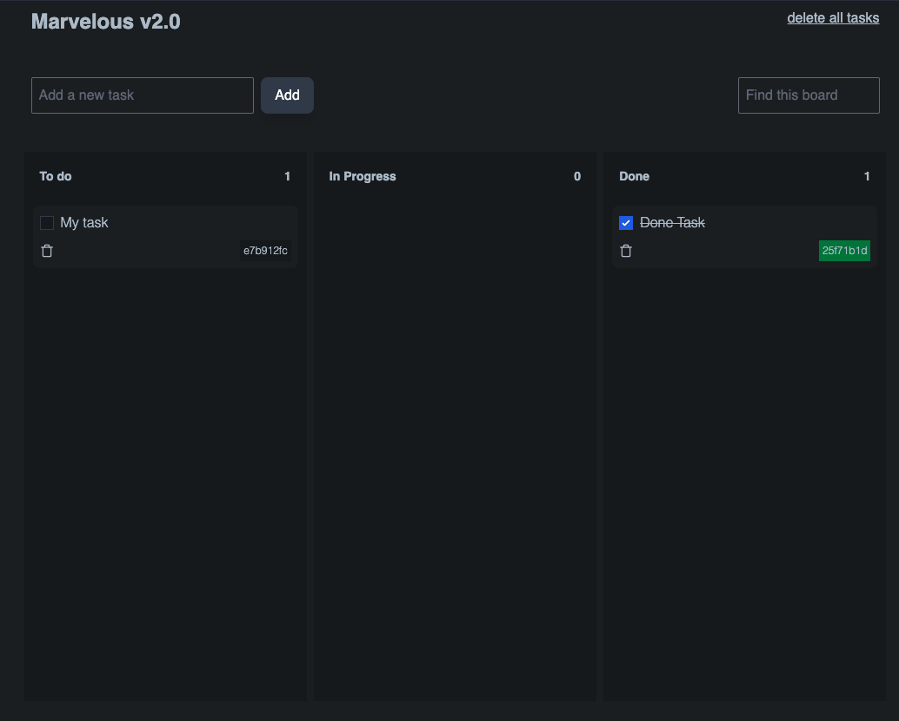

# hatchbetter


#### This is a repository for Coding Exercise Full-Stack

Welcome to the Code Exercise for HatchBetter  🌍

## Table of Contents
- [📚 Features](#-features)
- [Front-end](#front-end)
- [Back-end](#back-end)


## `features`
 - Drag-and-drop interface 
 - State management by zustand
 - Infinity-Scroll in columns 
 - Multiple columns
 - All Logic on server-side  
 - Responsive Design 
 - Unit Tests
 - One-Delete Task
 - Sync board: If you open the app in two different browsers, you will see the same board in both of them.   
 


## `Front-end`

- 🏎️ **[Next.js](https://nextjs.org/)** 
- 💅 **[Tailwind CSS](https://tailwindcss.com/)** 
- ✨ **[ESlint](https://eslint.org/)** and **[Prettier](https://prettier.io/)** 
- 🛠️ **[Typescrit](https://www.typescriptlang.org/)** 
- 📊 **[ReactJS](https://www.reactjs.org)** - 
- 🧪 **[Jest](https://jestjs.io/)** and **[React Testing Library](https://testing-library.com/react)** 


## `Back-end`

- 🏎️ **[Node.js](https://nodejs.org/en/)** 
- 💅 **[Fastify](https://fastify.dev/)** 
- 🛠️ **[Typescrit](https://www.typescriptlang.org/)** 
- 📊 **[SQLlite](https://www.https://www.sqlite.org/index.html)** -

## 🎯 Getting Started

To get started with this app, follow these steps:

1. Clone repository:

```bash
git clone https://github.com/shpsyte/ea-games.git
```

2. Install the dependencies on each folder `web` and `server`:

```bash
yarn install 
```

3. Under the server folder run:

```bash
yarn dev
```


3. Under the web folder run:

```bash
yarn dev
```

4. Open [http://localhost:3000](http://localhost:3000) with your browser to see the result.
 


